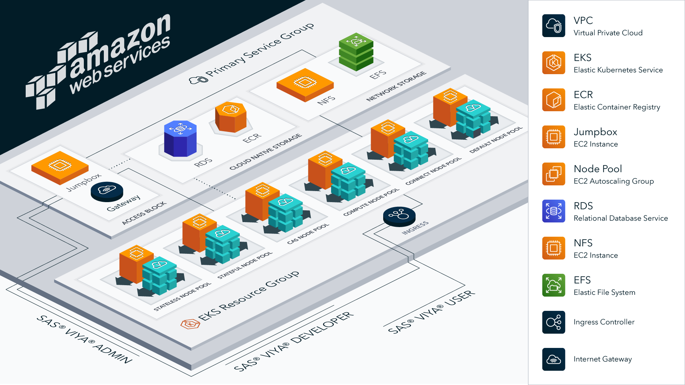

# SAS Viya 4 Infrastructure as Code (IaC) for Amazon Web Services (AWS)

## Overview

This project contains Terraform scripts to provision the AWS cloud infrastructure resources that are required to deploy SAS Viya platform product offerings. Here is a list of resources that this project can create:

  >- Amazon VPC and Security Group
  >- Managed Amazon Elastic Kubernetes Service (EKS)
  >- Amazon EKS managed node groups with required labels and taints
  >- Infrastructure to deploy the SAS Viya platform CAS server in SMP or MPP mode
  >- Amazon Elastic Block Storage (EBS) for NFS
  >- Amazon Elastic File System (EFS)
  >- Amazon Relational Database Service (RDS)

[](./docs/images/viya4-iac-aws-diag.png?raw=true)

This project helps you to automate the cluster-provisioning phase of SAS Viya platform deployment. To learn about all phases and options of the
SAS Viya platform deployment process, see [Getting Started with SAS Viya and Amazon Elastic Kubernetes Service](https://go.documentation.sas.com/doc/en/itopscdc/default/itopscon/p111dd1k5z99kin1f7mciggn9wop.htm) in _SAS&reg; Viya&reg; Platform Operations_.

Once the cloud resources are provisioned, use the [viya4-deployment](https://github.com/sassoftware/viya4-deployment) project to deploy
the SAS Viya platform in your cloud environment. For more information about SAS Viya platform requirements and documentation for the deployment
process, refer to the [SAS Viya platform Operations Guide](https://go.documentation.sas.com/doc/en/itopscdc/default/itopswlcm/home.htm).

## Prerequisites

Use of these tools requires operational knowledge of the following technologies:

- [Terraform](https://www.terraform.io/intro/index.html)
- [Docker](https://www.docker.com/)
- [AWS](https://aws.amazon.com)
- [Kubernetes](https://kubernetes.io/docs/concepts/)

### Technical Prerequisites

This project supports two options for running Terraform scripts:
- Terraform installed on your local machine
- Using a Docker container to run Terraform (Docker is required)

  For more information, see [Docker Usage](./docs/user/DockerUsage.md). Using Docker to run the Terraform scripts is recommended.

The following are also required:
- Access to an **AWS account** with a user that is associated with the applied [IAM Policy](./files/policies/devops-iac-eks-policy.json)
- Subscription to [Ubuntu 20.04 LTS - Focal](https://aws.amazon.com/marketplace/pp/prodview-iftkyuwv2sjxi)

#### Terraform Requirements:

- [Terraform](https://www.terraform.io/downloads.html) v1.0.0
- [kubectl](https://kubernetes.io/docs/tasks/tools/install-kubectl/) - v1.25.8
- [jq](https://stedolan.github.io/jq/) v1.6
- [AWS CLI](https://aws.amazon.com/cli) (optional; useful as an alternative to the AWS Web Console) v2.7.22

#### Docker Requirements:

- [Docker](https://docs.docker.com/get-docker/)

## Getting Started

Ubuntu 18.04 LTS is the operating system that is used on the jump server and NFS server VMs. Ubuntu creates the `/mnt` location as an ephemeral drive, so it cannot be used as the root location of the `jump_rwx_filestore_path` variable.

### Clone this Project

Run the following commands from a terminal session:

```bash
# clone this repo
git clone https://github.com/sassoftware/viya4-iac-aws
cd viya4-iac-aws
```

### Authenticate Terraform to Access AWS

In order to create and destroy AWS resources on your behalf, Terraform needs an AWS account that has sufficient permissions to perform all the actions defined in the Terraform manifest. See [Authenticating Terraform to Access AWS](./docs/user/TerraformAWSAuthentication.md) for details.


### Customize Input Values

Terraform scripts require variable definitions as input. Review and modify default values to meet your requirements. Create a file named
`terraform.tfvars` to customize any input variable value documented in the [CONFIG-VARS.md](docs/CONFIG-VARS.md) file.

To get started, you can copy one of the example variable definition files provided in the [examples](./examples) folder. For more information about the
variables that are declared in each file, refer to the [CONFIG-VARS.md](docs/CONFIG-VARS.md) file.

**NOTE:** You will need to update the `cidr_blocks` in the [variables.tf](variables.tf) file to allow traffic from your current network. Without these rules,
access to the cluster will only be allowed via the AWS Console.

You have the option to specify variable definitions that are not included in `terraform.tfvars` or to use a variable definition file other than
`terraform.tfvars`. See [Advanced Terraform Usage](docs/user/AdvancedTerraformUsage.md) for more information.

## Create and Manage Cloud Resources

Create and manage the required cloud resources. Perform one of the following steps, based on whether you are using Docker:

- run [Terraform](docs/user/TerraformUsage.md) directly on your workstation
- run the [Docker container](docs/user/DockerUsage.md) (recommended)

### Increase the Max Prepared Transactions for External Postgres Database

If you are using an external Postgres server, you will need to ensure that the max prepared transactions is at least 1024. You can verify this information by opening the AWS Console and navigating to the RDS Service. Select your Postgres instance, open the Configuration tab, and click on the link to the database's parameter group. Search for the 'max_prepared_transactions' parameter.

If the max prepared transactions is less than 1024, you will need to update the value. Click on the "Edit Parameters" button and change the value to 1024. Once you save your changes, you will need to wait for the database to apply the changes. This can be found back on the configuration tab. After it has been applied, you will need to reboot the database.

## Troubleshooting

See the [Troubleshooting](./docs/Troubleshooting.md) page for information about possible issues that you might encounter.

## Contributing

> We welcome your contributions! See [CONTRIBUTING.md](CONTRIBUTING.md) for details on how to submit contributions to this project.

## License

> This project is licensed under the [Apache 2.0 License](LICENSE).

## Additional Resources

### AWS Resources

- [Installing AWS CLI v2](https://docs.aws.amazon.com/cli/latest/userguide/install-cliv2.html)
- [AWS EKS Intro](https://docs.aws.amazon.com/eks/latest/userguide/what-is-eks.html)

### Terraform Resources

- [AWS Provider](https://registry.terraform.io/providers/hashicorp/aws/latest/docs)
- [AWS EKS](https://registry.terraform.io/providers/hashicorp/aws/latest/docs/resources/eks_cluster)
