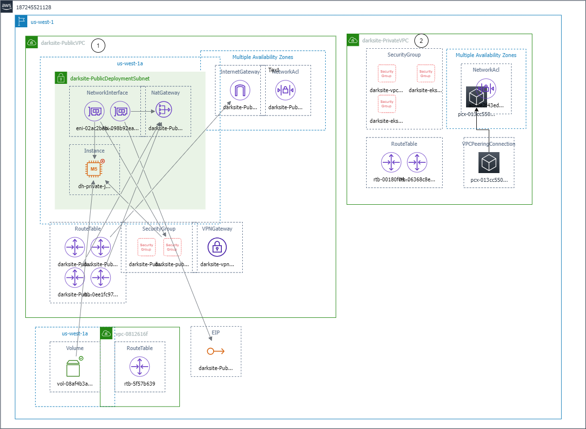

# AWS Dark Site Guidelines for IAC and DAC

A Dark Site presents a deployment scenario where the deployment machine is allowed Internet access (to obtain necessary Viya assets and baseline container images), but the Viya infrastructure (Jumpserver VM, NFS server VM, EKS cluster, etc.) is not.  An AWS Dark Site deployment scenario is the focus of these guidelines. This documentation focuses on using the `viya4-iac-aws`  and `viya4-deployment` project to perform a Dark Site deployment. Additional Dark Site documentation pertaining to use of the viya4-deployment project for a Dark Site deployment can be found [here](https://github.com/sassoftware/viya4-deployment/tree/main/docs/user/Darksite_Experimental.md).

An AWS "air-gapped site" is a deployment scenario in which neither the cluster nor the deployment machine have inbound or outbound Internet access.  An air-gapped scenario would require the guidelines presented here plus additional considerations: a mechanism to get all the requisite software/tooling installed on the deployment machine and a mechanism or process to get images and helm charts into an internal repository accessible by the cluster.   

:memo: Note: The current release of the `viya-deployment` project does **not** support deploying Viya in an air-gapped environment

### :memo: Notes

Information provided here has been tested with:
- viya4-iac-aws:8.2.0
- viya4-deployment:6.19.0

### Acknowledgments

The following individuals have contributed documentation and code that provided the basis for this document.
- Josh Coburn
- Matthias Ender

## Dark Site Deployment Instructions

This project contains documentation and helper scripts to facilitate a Dark Site deployment of Viya to an AWS EKS Kubernetes cluster.  A checklist for the steps that are necessary to successfully deploy Viya in a dark site environment is provided. The documentation provides guidance on how to perform a Viya deployment using additional tools and procedures not present in the base `viya4-aws-iac` project. This documentation is intended to add to the existing project documentation and provide some additional instructions required to succeed with a Viya 4 deployment in a Dark Site scenario.

The dark site deployment guidelines within this document were tested with the IAC And DAC versions noted above.  Keep in mind that behavior can change if using a newer version of IAC or DAC so you may need to adapt these instructions to adjust for any different behavior.

## Using these guidelines

These guidelines describe the AWS resources that comprise an example Dark Site configuration and provide the instructions for using IAC and DAC to create an EKS private cluster and deploy the Viya Platform to that cluster.

## Creating a Dark Site environment

:memo: **Note**: For a Dark Site deployment, it is recommended that you Bring Your Own Network (full) and convey that existing network information to IAC when running it. Bringing your own network means creating your VPC or VPCs, Subnets, AWS private endpoints, and Network Security Groups instead of letting IAC create these items for you.  If you attempt to rely on IAC to create the network infrastructure and are in a Dark Site scenario, you will likely run into failure points.  The IAC project preparation and deployment guidelines outlined in this document assumes that bringing your own full network resources is the approach that will be used.

### Example AWS resources for using IAC to create an EKS cluster and DAC to deploy Viya to a Dark Site environment

### Canonical Dark Site network configuration

While there are multiple ways to configure an AWS Dark Site, the textual description below and the diagram that illustrates it will be the Dark Site configuration referred to in the usage steps for this document.

:memo: **Note**: The (#) annotations within the text refer to the circled numbers in the diagram below.

1. Two VPCs, one public and one private. 
1. Inside the public VPC (1) 
    - one public subnet with a default route to the Internet via a NAT and IGW. 
    - network security group (3) to permit SSH access to the EC2 deployment instance
    - EC2 instance deployment VM (4)
1. Inside the private VPC (2)
    - one private subnet 
    - two control_plane subnets 
    - two database subnets, if IAC is configured to create an external PostgresSQL instance 
    - three network security groups (5) to manage access to private VPC, EKS cluster and workers
    - the [VPC private endpoints](https://eksctl.io/usage/eks-private-cluster/#configuring-private-access-to-additional-aws-services) to enable worker nodes access to AWS services inside a private cluster
    - route tables with routes to direct cross VPC traffic from public VPC to private VPC and vice versa
    - an S3 bucket (optional) (if you'd like to use it to persist storage of deployment assets and facilitate tear down and quick rebuild of the lab environment).  
1. Across the two VPCs 
    - VPC Peering connection to allow traffic to flow between the public and private VPCs

### Dark Site Network Configuration

There are many different networking configurations that can constitute a Dark Site deployment.
The diagram below illustrates a Dark Site configuration with 2 VPCs, one public and one private.

Two VPCs serve to separate (the cluster, PostgresSQL instance (if external PG is required), and storage) the private VPC from the deployment machine/user ingress which exist in the Public VPC.  The VPCs are then connected via a Peering connection.  The peering connection simulates some other link mechanism you might find in a customer site, such as a Transit Gateway or other traffic routing mechanism, which would be used to route user traffic to Viya.

*Diagram 1: Two VPCs Dark Site network architecture*

In the diagram above, the private VPC has no route to the public IGW, so ALL Viya components remain truly private because it can only communicate to the public subnet via the VPC Peering Connection.  The public VPC has a default route to the Internet via a NAT and IGW, and also has a route to the private VPC (and subnets) via the VPC Peering connection.  The public VPC serves as the home for the deployment VM, and could also be used to house "user" VMs to simulate user traffic into Viya.

### What is a Dark Site Network Configuration ?

1. Start by creating or noting the AWS resources that constitute your AWS Dark Site network configuration.

    A Dark Site configuration can take different forms, some examples are:
      - Two VPCs, one public (for the deployment VM) and one private (for the EKS cluster) that utilizes a VPC Peering Connection to permit traffic flow between the public and private VPCs. This configuration is depicted in Diagram 1.
      - A single private VPC that utilizes an AWS Transit Gateway to interconnect two or more VPCs.
    
   You can connect other VPCs to the VPC with an interface endpoint using an AWS Transit Gateway or VPC peering. VPC peering is a networking connection between two VPCs. You can establish a VPC peering connection between your VPCs, or with a VPC in another account. The VPCs can be in different AWS Regions. Traffic between peered VPCs stays on the AWS network. The traffic doesn't traverse the public Internet. A Transit Gateway is a network transit hub that you can use to interconnect VPCs. Traffic between a VPC and a Transit Gateway remains on the AWS global private network. The traffic isn't exposed to the public Internet.

## How to Use the Dark Site Helper Scripts

- Copy deployment-machine-assets to deployment machine:
  - Copy (scp or rsync) the contents of the ["deployment-machine-assets/"](https://github.com/sassoftware/viya4-deployment/blob/feat/iac-1117/viya4-deployment-darksite/deployment-machine-assets) ["deployment-machine-assets/"](https://github.com/sassoftware/viya4-deployment/blob/main/viya4-deployment-darksite/deployment-machine-assets) directory to the "/home/ec2-user/viya/" directory created by you on your deployment VM. 

- Copy (scp or rsync) the ["darksite-iac-aws-mods.sh"](https://github.com/sassoftware/viya4-iac-aws/blob/feat/iac-1117/viya4-iac-aws-darksite/darksite-iac-aws-mods/darksite-iac-aws-mods.sh) script to the "/home/ec2-user/viya/gitrepos/" directory created by you on your deployment VM.
- Copy (scp or rsync) the ["baseline-to-ecr"](https://github.com/sassoftware/viya4-deployment/blob/feat/iac-1117/viya4-deployment-darksite/baseline-to-ecr/) ["baseline-to-ecr"](https://github.com/sassoftware/viya4-deployment/blob/main/viya4-deployment-darksite/baseline-to-ecr/) and ["mirrormgr-to-ecr"](https://github.com/sassoftware/viya4-deployment/blob/feat/iac-1117/viya4-deployment-darksite/mirrormgr-to-ecr)  ["mirrormgr-to-ecr"](https://github.com/sassoftware/viya4-deployment/blob/main/viya4-deployment-darksite/mirrormgr-to-ecr) directories to "/home/ec2-user/viya/" directory.
- Manually download and copy your Viya deployment assets,license, and certs files into: "/home/ec2-user/viya/software/viya_assets/" directory. We will bypass the SAS Viya Orders API during deployment, by manually providing these in our ansible-vars.yaml.
- (Optional) If you want to use OpenLDAP, you'll also need to copy (scp or rsync) the ["darksite-openldap-mod.sh"](https://github.com/sassoftware/viya4-deployment/blob/feat/iac-1117/viya4-deployment-darksite/darksite-openldap-mod/darksite-openldap-mod.sh) ["darksite-openldap-mod.sh"](https://github.com/sassoftware/viya4-deployment/blob/main/viya4-deployment-darksite/darksite-openldap-mod/darksite-openldap-mod.sh) to the "/home/ec2-user/gitrepos/" directory.

**FIX gitlab LINKS**  
Step 4 - Create Custom AMI for the jumpserver and nfs-server:
- The base image used by IAC does not include the required nfs related packages.  During initialization, IAC installs the nfs packages as part of the VM initialization.  In a darksite, this will not be possible.  To correct this, we'll need to create our own custom AMI and then slightly mod our viya4-iac-aws repo to add refernces for our AMI as well as remove the initialization steps in the cloud-init files (for jumpserver and nfs-server).  Instructions to complete these steps can be found [here](https://gitlab.sas.com/jocobu/viya4-aws-darksite/-/tree/main/viya4-iac-aws/custom-ami/).

**FIX gitlab LINKS**  
Step 4 - Deployment fun:
- Mod your viya4-iac-aws clone. ["darksite-iac-aws-mods.sh"](https://gitlab.sas.com/jocobu/viya4-aws-darksite/-/tree/main/viya4-iac-aws/darksite-iac-aws-mods/darksite-iac-aws-mods.sh).  If you completed Step 3 - it should be located in the "/home/ec2-user/viya/gitrepos/" directory on the deployment machine.  Use it to also build the modded container (or build it manually if you'd like).
- Update your terraform.tfvars (/home/ec2-user/viya/infrastructure/).  I've tried to make this as dummy proof as possible..
- Deploy IaC.  I have provided a helper script for this /home/ec2-user/viya/01_iac_deploy.sh (simply automates the docker commands)

**FIX gitlab LINKS**  
- Push helm charts and images (baseline and Viya) to ECR. Helper scripts: ["baseline-to-ecr"](https://gitlab.sas.com/jocobu/viya4-aws-darksite/-/tree/main/viya4-deployment/baseline-to-ecr/) and ["mirrormgr-to-ecr"](https://gitlab.sas.com/jocobu/viya4-aws-darksite/-/tree/main/viya4-deployment/mirrormgr-to-ecr) should be located in "/home/ec2-user/viya/" directory (if completed in Step 3)
- (Optional) Run the viya4-deployment-openldap-mod and build the corresponding container.  ["darksite-openldap-mod.sh"](https://gitlab.sas.com/jocobu/viya4-aws-darksite/-/tree/main/viya4-deployment/darksite-openldap-mod.sh) should be in "/home/ec2-user/gitrepos/" directory (if complete in Step 3).
- Update ansible-vars-iac.yaml (/home/ec2-user/viya/software/).  I've tried to make this as dummy proof as possible.. you'll need to overwrite ALL of the following parameteres:
    - {{ AWS_ACCT_ID }}
    - {{ AWS_REGION }}
    - {{ CONTROLLER_ECR_IMAGE_DIGEST }} - nginx requires the digest to match for this image (you can get this from ECR)
    - {{ WEBHOOK_ECR_IMAGE_DIGEST }} - nginx requires the digest to match for this image (you can get this from ECR)
- Optional: update sitedefault.yaml (/home/ec2-user/viya/software/)
- Deploy DaC. I have provided a helper script for this /home/ec2-user/viya/02_dac_deploy.sh (simply automates the docker commands)

### Continue With Steps for Using viya4-iac-aws GitHub Project in a Dark Site Deployment Scenario (Experimental)

https://github.com/sassoftware/viya4-iac-aws/blob/darksite-experimental/viya4-iac-aws-darksite/IAC-README.md

### Continue With Steps to Deploy to AWS EKS in a Dark Site Scenario (Experimental)

https://github.com/sassoftware/viya4-iac-aws/blob/darksite-experimental/viya4-iac-aws-darksite/DAC-README.md

