## AWS Darksite Custom AMI
By default, `viya4-iac-aws` uses the base Canonical Ubuntu Server image, which does not have the required `nfs-kernel-server` package.  IAC installs these packages as part of the `cloud-init` process, however this is not possible in a Dark Site which has no outbound Internet access.  Below are instructions for creating a custom AMI which will ensure that `nfs-kernel-server` packages are installed for both the jumpserver and NFS server.

Once the AMI is created, you can then apply the modified AMI to `viya4-iac-aws` by running the ["darksite-iac-aws-mods.sh"](https://github.com/sassoftware/viya4-iac-aws/blob/feat/iac-1117/viya4-iac-aws-darksite/darksite-iac-aws-mods/darksite-iac-aws-mods.sh) ["darksite-iac-aws-mods.sh"](https://github.com/sassoftware/viya4-iac-aws/blob/main/viya4-iac-aws-darksite/darksite-iac-aws-mods/darksite-iac-aws-mods.sh) script.

## Notes
This information was provided by Frederik Vandenberghe.  

## Launch EC2-instance based on the current AMI in use
First thing to do is launch an EC2-instance based on the AMI that's in use as AWS-base image for the nfs-server and the jump-server.  You can see which AMI that is in https://github.com/sassoftware/viya4-iac-aws/blob/main/modules/aws_vm/main.tf

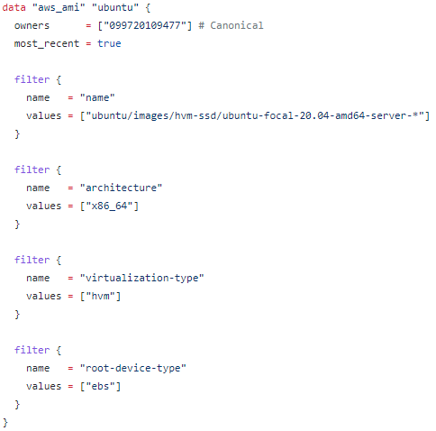

It's an AMI owned by Canonical AWS account (Canonical is company behind Ubuntu) that provides an Ubuntu AWS AMI images.  So you can find that image in the AMI Catalog by searching with the same search criteria as specified in that main.tf file.

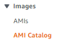 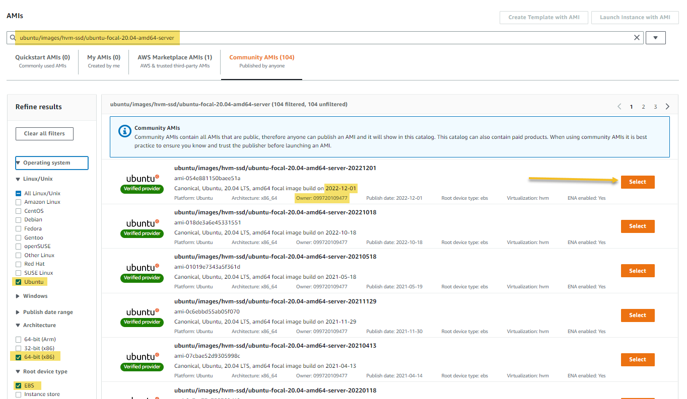


And exactly like in the main.tf (most_recent = true) select the most recent version and click on Launch Instance with AMI.

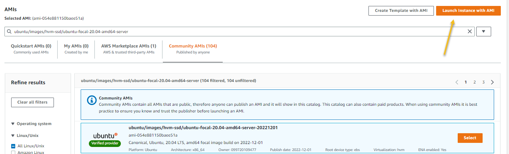


Give the new instance a name that you will remember.  I choosed m5.xlarge as instance type to stay in sync with the iac scripts.

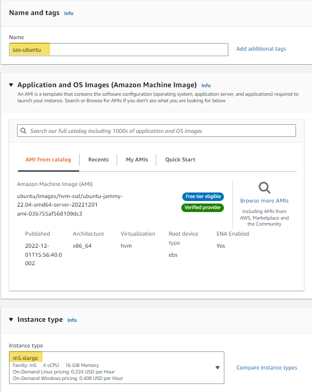

For the keypair, you'll want to use a keypair you own and the same keypair you plan on using for viya4-iac-aws and viya4-deployment.  If the public key you'd like to use isn't in EC2 already.. import it now (EC2 > key pairs > import key pair).  In the screenshot below, the key pair has been named "aws-key".

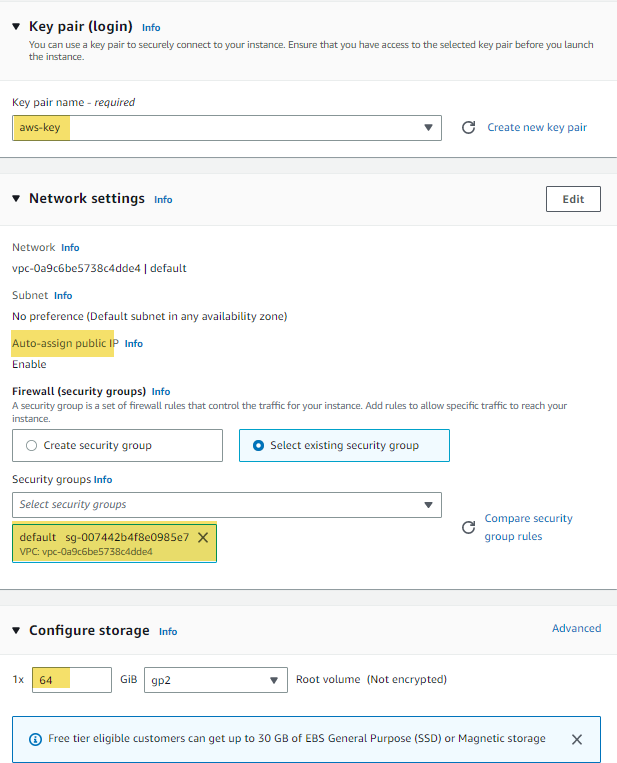

Click launch instance.

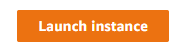

Wait for the initialization, check for the assigned IP address and setup SSH session to the running EC2-instance with your private SSH-key.  User to use will be ubuntu. 

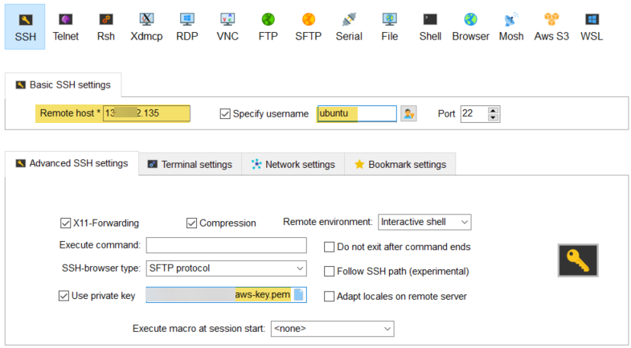


## Install nfs-kernel-server on running EC2-instance

Run the following commands on the Ubuntu EC2-instance.

```shell
sudo apt update

sudo apt upgrade

sudo apt install nfs-kernel-server
```

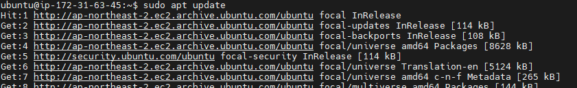


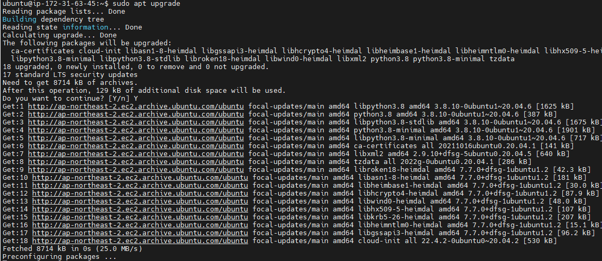

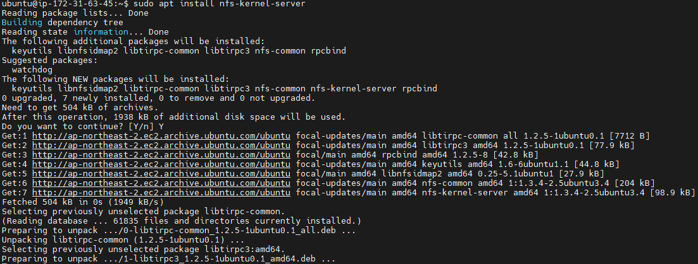


You can now stop the EC2-instance.


## Create AMI AWS base image 

Once the EC2-instance where you install nfs-kernel-server is stopped, you can create from that EC2-instance a AWS AMI image.  For that click right on the instance, select Image and templates, Create image.

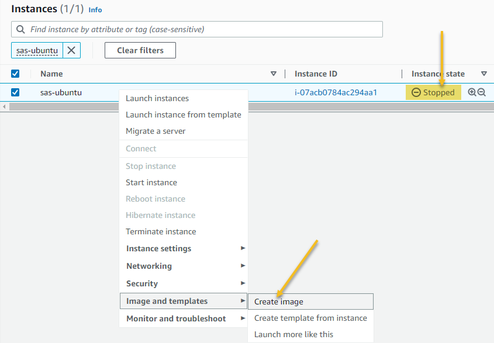


Give the image a menaningful name and description and click Create image button.

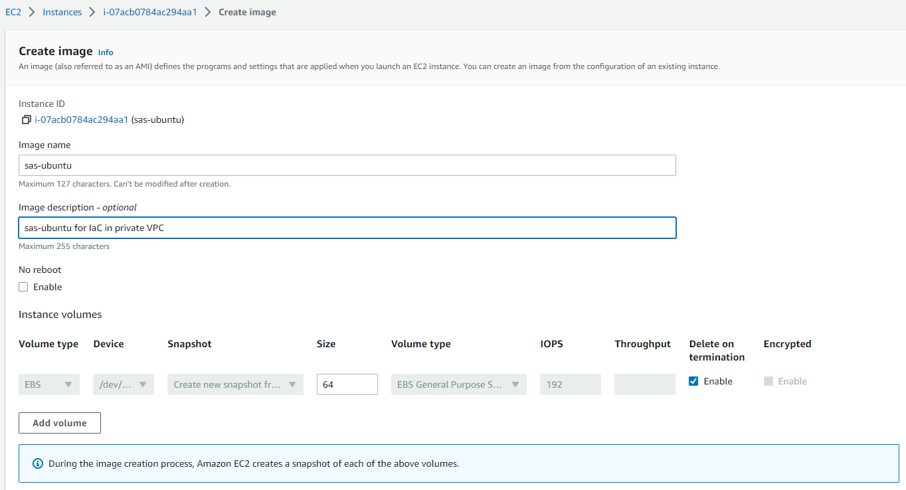

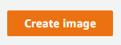

You can find your image here:

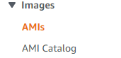


Search for private images. Initially it will have status pending.


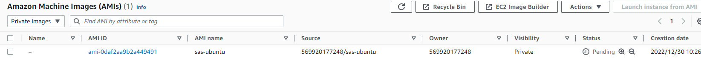


Wait until the `Status` column indicates it is available.


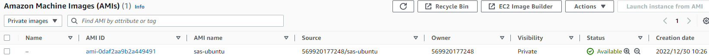


## Clone viya4-iac-aws and modify it so that it's using private owned AMI as AWS base image for NFS and JUMP server

A helper script is provided at [helper script](https://github.com/sassoftware/viya4-iac-aws/-/tree/main/viya4-iac-aws-darksite/custom-ami/) [helper script](https://github.com/sassoftware/viya4-iac-aws/tree/feat/iac-1117/viya4-iac-aws-darksite/custom-ami/) to automatically mod the viya4-iac-aws clone.  However if you'd like to do this manually, here are the proceedures:


Clone viya4-iac-aws

https://github.com/sassoftware/viya4-iac-aws.git

```shell
git clone https://github.com/sassoftware/viya4-iac-aws.git
```

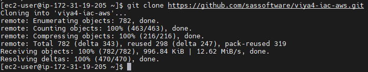


Go to $WORK_FOLDER/viya4-iac-aws/modules/aws_vm/main.tf

In that file replace field owners AWS account with the AWS account where you created  the AMI.  Also change the name with the name you provided before as input while creating AWS image.  That way IaC will use new created AWS AMI image as base for NFS and JUMP server.

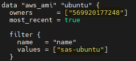

You can now adapt the cloud-init of NFS and JUMP server as follows.

Go to $WORK_FOLDER/viya4-iac-aws/files/cloud-init/nfs/cloud-config and change as follows:

1 Disable update and upgrade as there's no internet access

2 Disable installation of nfs-kernel-server, again there's no internet access and we did before


3 Loop only over $public_subnet_cidrs as $private_subnet_cidrs will be the same when deploying with Josh his script on private VPC.

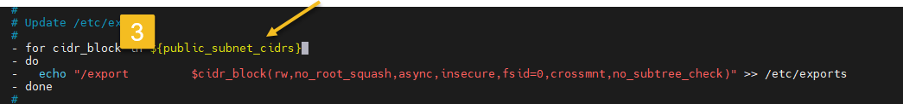

Go to $WORK_FOLDER/viya4-iac-aws/files/cloud-init/jump/cloud-config and change as follows:

1 Disable update and upgrade as there's no internet access

2 Disable installation of nfs-common, again there's no internet access

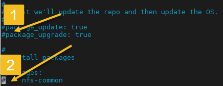


Now you're ready to build your viya4-iac-aws docker. I would recommend to give it unique name so you remember why you customized it.

```shell
docker build -t viya4-iaw-aws-private:5.4.0 .
```

